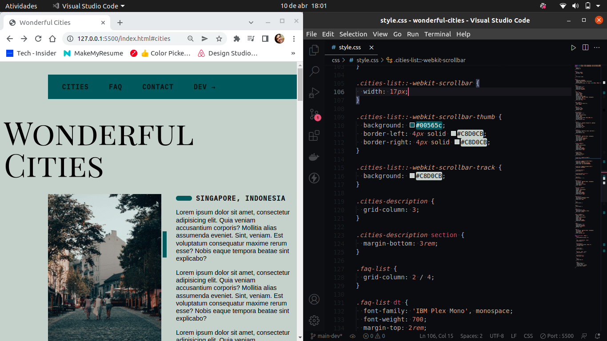

<h1 align="center">🌆 Wonderful Cities 🏖️</h1>

  This is my Wonderful Cities project, where i'm putting in practice some skills, that i will specify below, and talking a little about cool cities that I want to visit some day.

<h1>Putting in practice</h1>

- CSS: Grid Layout
- Cypress: UI tests
- TypeScript: DOM Events
- Writing

<h1>A glimpse</h1>

- Available at <a href="https://guihtryb.github.io/wonderful-cities/">this link</a>
